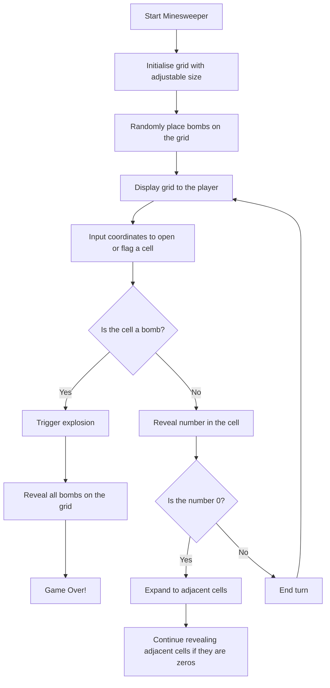
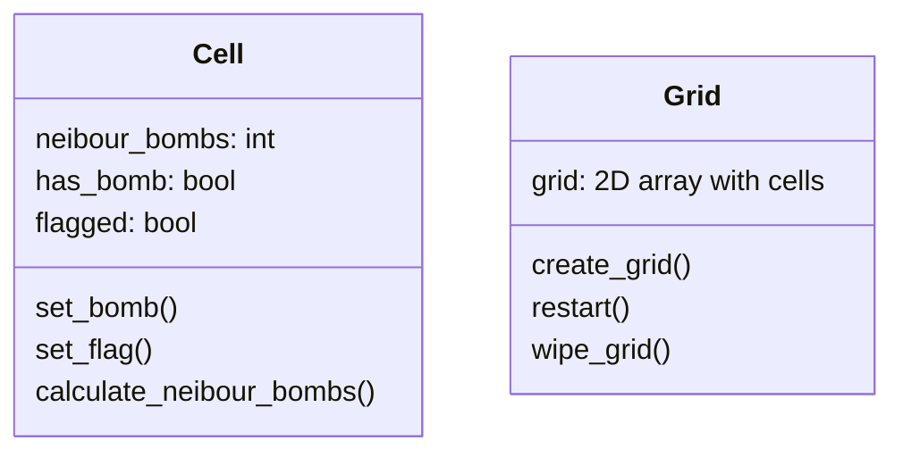

# IT2 Game
- Smidig utvikling
## Possible games?
- Pong
- Yatzi
- Minesweeper
- Flappy bird

## Minesweeper
Målet med spillet er å få vekk minene i et minefelt uten at de sprenger. Dette kan man få til ved å se på tallene i minefeltet som viser hvor mange miner som er rundt denne ruten. med denne informasjonen skal det være mulig å kunne unngå å sprenge minene. 

### Flowchart

### Classes:

## arbeidsoppgaver 
- Alexander
    - Lage klassen "grid"

- Ulrik
    - Lage klassediagram for game
    - Lage klassen "game"

- Dina
    - Lage klassen "cell"