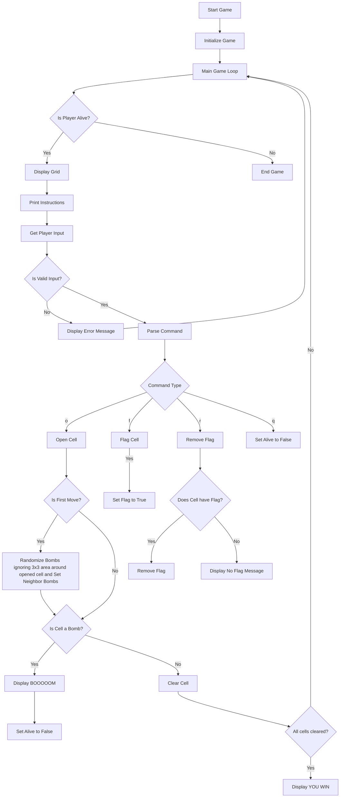
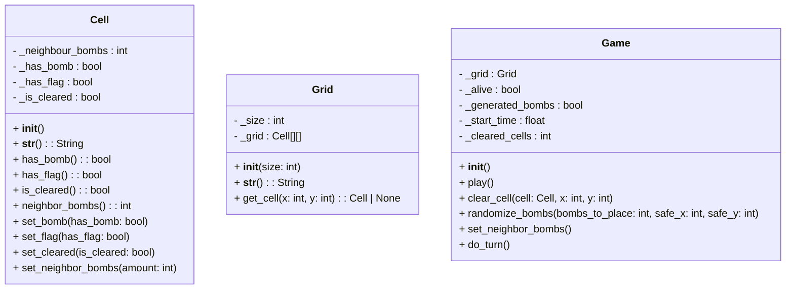

# IT2 Game
- Smidig utvikling

## Minesweeper
Målet med spillet er å få vekk minene i et minefelt uten at de sprenger. Dette kan man få til ved å se på tallene i minefeltet som viser hvor mange miner som er rundt denne ruten. Med denne informasjonen skal det være mulig å kunne unngå å sprenge minene. 

### Flowchart

### Classes:
